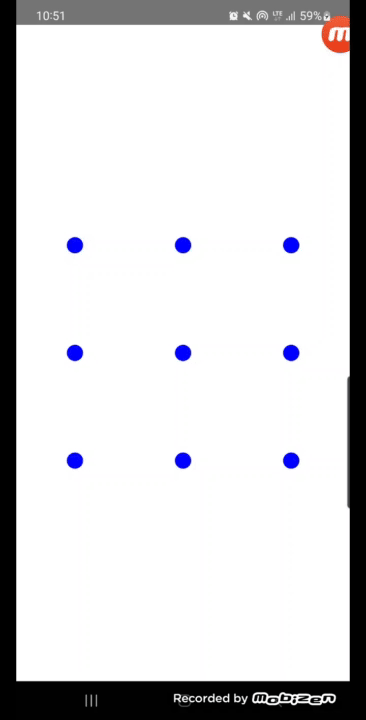

<h1 align="center">Pattern Lock Screen</h1>

<p align="center">  
🌻 This library is pattern lock screen with making composable function. this is made by calculating offset of axis x and y.
</p>


# How to import this library?
## 1. copy and past this  into project level `build.gradle.kts`
```kotlin
allprojects {
    repositories {
        mavenCentral()
    }
}
```
## 2. copy and paste this dependency into app level `build.gradle.kts`
```kotlin
dependencies {
    implementation("io.github.squart300kg:pattern-lock-screen:1.0.0")
}
```

# How to handle this library?
The below code is default usage setting. first of all is to declare ```BasePatternScreen``` and inject ```DrawingSetting()``` object into the parameter of ```drawingSetting```. finally code your own logic at the method of ```onLessCountPatternSelected``` and ```onPatternSuccessfullySelected```. If you follow this guide, you can see the below demonstration gif image.


**<div align="center">[Code Snipet]</div>**
```kotlin
override fun onCreate(savedInstanceState: Bundle?) {
    super.onCreate(savedInstanceState)
    setContent {
        MaterialTheme {
            Surface(
                modifier = Modifier.fillMaxSize(),
                color = Color.White,
            ) {
                Column {
                    Spacer(modifier = Modifier.weight(1f))
                    BasePatternScreen(
                        modifier = Modifier.size(400.dp),
                        drawingSetting = DrawingSetting(),
                        onLessCountPatternSelected = { selectedCount ->
                            // code your own logic
                            showToast(getString(R.string.lessPatternSelectedGuide, selectedCount))
                        },
                        onPatternSuccessfullySelected = { result ->
                            // code your own logic
                            showToast(getString(R.string.patternSuccessfullySelectedGuide, result))
                        }
                    )
                    Spacer(modifier = Modifier.weight(1f))
                }
            }
        }
    }
}
```

**<div align="center">[Demonstration]</div>**
**<div align="center"></div>**


> **[Note]** : Default setting is that unselected dot color is blue, selected dot color is pink, dot size is 10dp, line width size is 4dp, pattern line coloe is cyon, minimum line connection count is 3, vibrate time when selecte dot is 20L.

# How to handle this customically?
you can use this library customically by variating the object of `DrawingSetting()`. this object is the key of usage by cumomically. Let's see this library's struct.
```kotlin
data class DrawingSetting(
    val dotSize: Dp = 10.dp,
    val lineWidth: Dp = 4.dp,
    val lineColor: Color = Color.Blue,
    val selectedDotColor: Color = Color.Blue,
    val unselectedDotColor: Color = Color.Gray,
    val minimumLineConnectionCount: Int = 2,
    val vibrateTime: Long = 20L,
)
```
If you read the parameters carefully, you will be able to understand them intuitively. The below table is the parameter description.
## 1. Field Description

| filed | type | default value |demonstration |
|-------|---------------|---------------|--------------|
|dotSize| Dp | 10.dp         |circle dot size|
|lineWidth|Dp| 4.dp          |line width when drawing between circle dots|
|lineColor|Color| Color.Blue    |line color when drawing|
|selectedDotColor|Color| Color.Blue    |selected dot color when you click the dot|
|unselectedDotColor|Color| Color.Gray    |as default dot colot, unselected dot color.|
|minimumLineConnectionCount|Int| 2             |minimum number of line to be drawn|
|vibrateTime|Long| 20L           |vibrate time when you selected circle dot |

## 2. The example of usage
Let’s learn about custom use cases by modifying each field of the `DrawingSetting` object through gif images.
### 2.1. customize `lineWidth`

Make the drawing line size smaller or larger

|default setting demonstration| | variate `lineWidth` demonstration|
|--|--|--|
|| → ||

### 2.2. customize `lineColor`

Variate the drawing line color what you want

|default setting demonstration| |variate `lineColor` demonstration|
|--|--|--|
|| → ||

### 2.3. customize `selectedDotColor`

Variate the circle selected dot color what you want

|default setting demonstration| |variate `selectedDotColor` demonstration|
|--|--|--|
|| → ||

### 2.4. customize `unselectedDotColor`

Variate the circle unselected dot color what you want

|default setting demonstration| |variate `unselectedDotColor` demonstration|
|--|--|--|
|| → ||

### 2.5. customize `minimumLineConnectionCount`

Declare the minimum number of line that must be drawn.

|default setting demonstration| |variate `minimumLineConnectionCount` demonstration|
|--|--|--|
|| → ||

# License
```xml
Designed and developed by 2024 squart300kg (sangyoon song)

Licensed under the Apache License, Version 2.0 (the "License");
you may not use this file except in compliance with the License.
You may obtain a copy of the License at

   http://www.apache.org/licenses/LICENSE-2.0

Unless required by applicable law or agreed to in writing, software
distributed under the License is distributed on an "AS IS" BASIS,
WITHOUT WARRANTIES OR CONDITIONS OF ANY KIND, either express or implied.
See the License for the specific language governing permissions and
limitations under the License.